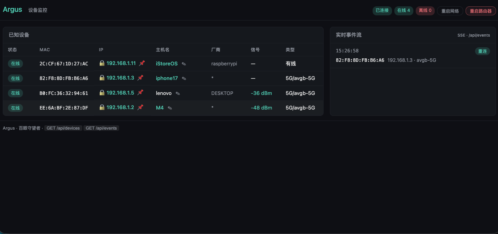
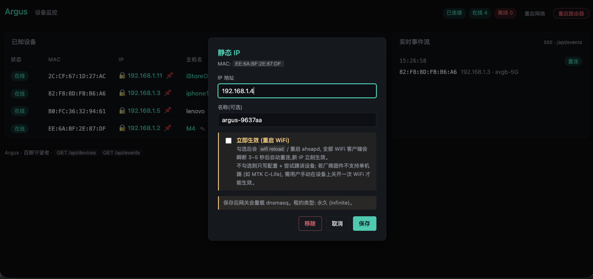
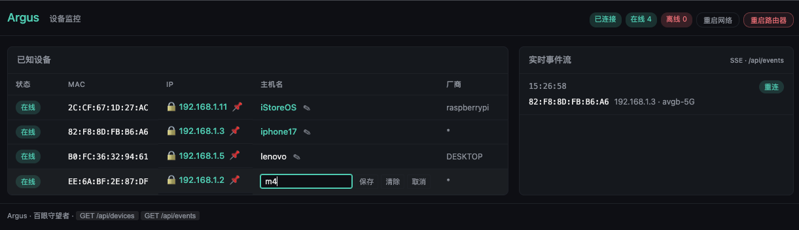
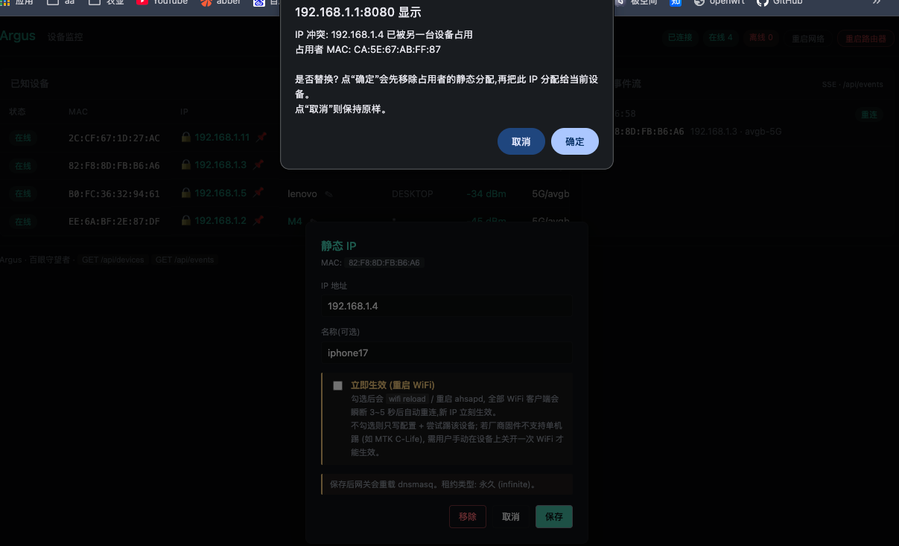
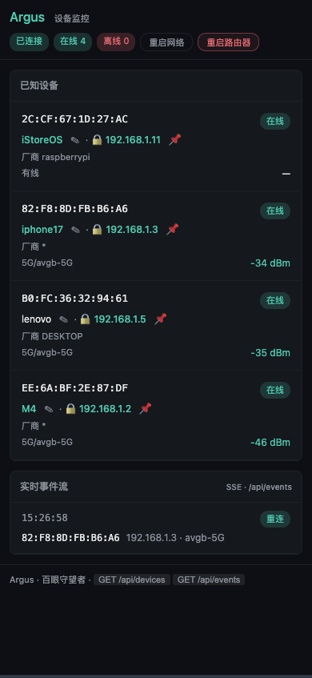

# Argus

> **Real-time OpenWrt device presence & static-IP dashboard — multi-source fusion, sub-second events, zero-dep Web UI**
> **多源融合、秒级事件、零依赖 Web UI 的 OpenWrt 接入设备观察库**

[](https://pkg.go.dev/github.com/xxl6097/argusd)
[](https://goreportcard.com/report/github.com/xxl6097/argusd)
[](go.mod)
[](LICENSE)
[](.)
[](https://github.com/xxl6097/argusd/releases)



**EN** — Argus is a Go library + CLI for **real-time WiFi/wired device presence** on OpenWrt routers. It fuses six data sources (ahsapd · hostapd · `logread` · DHCP leases · ARP · ICMP) into a single sub-second event stream — `Online` / `Offline` / `Change` — and ships an **opt-in Web UI** with static-IP reservations, device aliases, and one-click recovery tools. Zero-dep, works on stock OpenWrt + MediaTek vendor firmwares (C-Life and similar). Named after the hundred-eyed giant of Greek myth — whose eyes never all slept.

**中文** — Argus 是一个针对 OpenWrt 路由器的**实时设备感知库与命令行工具**,融合六路数据源(ahsapd · hostapd · syslog · DHCP 租约 · ARP · ICMP)形成秒级事件流:上线(`Online`) / 离线(`Offline`) / 状态变更(`Change`),并内置**零依赖 Web UI**(静态 IP 预留、设备别名、一键修复)。名字取自希腊神话中的百眼巨人——他的眼睛永远不会同时闭上——永不沉睡的守望者。

**Quick start · 30 秒跑起来**:

```bash
# 下载 · Releases page: https://github.com/xxl6097/argusd/releases
scp argusd root@192.168.1.1:/tmp/ && ssh root@192.168.1.1 \
  '/tmp/argusd -listen :8080 -aliases /etc/argusd/aliases.json'
# 浏览器 · Open http://<router-ip>:8080/
```

---

## 目录 · Table of Contents

1. [特性 · Features](#特性--features)
2. [快速开始 · Quick Start](#快速开始--quick-start)
3. [Web UI · 内置仪表盘](#web-ui--内置仪表盘-v0130)
4. [架构 · Architecture](#架构--architecture)
5. [API 速查 · API Overview](#api-速查--api-overview)
6. [配置调优 · Configuration](#配置调优--configuration)
7. [可观测性 · Observability](#可观测性--observability)
8. [路线图 · Roadmap](#路线图--roadmap)
9. [兼容性 · Compatibility](#兼容性--compatibility)
10. [贡献 · Contributing](#贡献--contributing)

---

## 特性 · Features

- 🔀 **多源融合 · Multi-source fusion**
  **EN** — ahsapd + hostapd + `logread -f` + DHCP leases + ARP states + ICMP probe, all merged into one stream.
  **中文** — 厂商 ubus(ahsapd) + 官方 hostapd + 系统日志 + DHCP 租约 + ARP 状态 + ICMP 探测,六路同步汇聚为单一事件流。

- 🏭 **零配置多厂商兼容 · Vendor-agnostic zero-config**
  **EN** — Auto-detects `ahsapd` (vendor firmware) or `hostapd.*` (stock OpenWrt) at startup.
  **中文** — 启动时自动探测 ubus 可用服务,厂商固件与官方 OpenWrt 无需配置切换。

- ⚡ **毫秒级事件 · Sub-second events**
  **EN** — Kernel log streaming (`New Sta`, `Del Sta`, `Deauth`, `DHCPACK`…) delivers online/offline in 1-2 s.
  **中文** — 通过实时日志(内核关联 / 断开 / Deauth / DHCP 分配)在 1-2 秒内识别上下线。

- 🛡️ **多维离线判定 · Multi-dimensional offline detection**
  **EN** — Three-layer decision: ICMP ping filter + AP association table with RSSI tiers + ARP `FAILED/INCOMPLETE` shortcut.
  **中文** — 三层判定:ICMP 可达性 + AP 关联表感知(息屏保护) & RSSI 信号分级 + ARP 失败加速。

- 🌊 **抗抖动 · Flap suppression**
  **EN** — 90 s cooldown plus 30 s same-kind suppression window eliminates weak-signal thrashing. Both independently toggleable via `Config.DisableCooldown` / `DisableFlapSuppression`.
  **中文** — 90 秒冷却期 + 30 秒同类事件压制,弱信号边缘设备不再反复上下线。通过 `Config.DisableCooldown` / `DisableFlapSuppression` 可独立关闭任一机制。

- 🧩 **纯标准库 · Pure stdlib, single static binary**
  **EN** — ~2.6 MB static binary (`CGO_ENABLED=0`, GOARCH=arm64). Drop into `/tmp` and run.
  **中文** — 纯 Go 标准库,静态编译,约 2.6 MB,直接丢到 OpenWrt 路由器 `/tmp` 即可运行。

- 🔬 **可观测性 · Observability**
  **EN** — Four hook surfaces, all opt-in and zero-cost when unused:
  `DecisionHandler` (1.7 ns/op, 0 allocs) surfaces 17 internal branch decisions;
  `WithLogger` emits structured logs (slog/zap/zerolog adapter in ~5 lines);
  `WithSpanRecorder` emits distributed-tracing spans (OTel adapter ~15 lines);
  the `argusmetrics` subpackage ships zero-dependency counters
  (`Counters` / `LabeledCounters`) ready to bridge to Prometheus / OTLP.
  **中文** — 四路可观测性出口,全部 opt-in, 未注册时零成本:
  `DecisionHandler`(1.7 ns/op, 0 分配)暴露 17 种内部判定分支;
  `WithLogger` 结构化日志(~5 行桥接 slog/zap/zerolog);
  `WithSpanRecorder` 分布式追踪(OTel ~15 行);
  `argusmetrics` 子包自带零依赖计数器(`Counters` / `LabeledCounters`),
  可直接桥接 Prometheus / OTLP。

- 🔒 **安全硬化 · Security hardened**
  **EN** — IP regex + `net.ParseIP` double validation, interface whitelist — no command injection.
  **中文** — IP 双重校验(正则 + `net.ParseIP`)、hostapd 接口名白名单,杜绝命令注入。

- 🧵 **并发安全 · Concurrency-safe**
  **EN** — `sync.Mutex` protects shared state; events emitted outside the lock; `go test -race` clean across 60+ tests and 9 lifecycle tests.
  **中文** — `sync.Mutex` 保护共享状态,事件在锁外发射;60+ 测试 + 9 个生命周期测试均通过 `-race`。

- 🛟 **Panic 隔离 · Panic-safe callbacks**
  **EN** — User callbacks (`EventHandler` / `ErrorHandler` / `DecisionHandler`) are wrapped with `defer recover`. An `EventHandler` panic is reported via `onError` and does not kill any Watcher goroutine.
  **中文** — 用户回调(`EventHandler` / `ErrorHandler` / `DecisionHandler`)全部被 `defer recover` 包裹。业务 handler panic 会经 `onError` 上报,不会杀死 Watcher 的任何 goroutine。

- 🔄 **可热重载 · Hot-reload lifecycle (v0.5.0+)**
  **EN** — `Watcher.Stop(ctx)` + re-run preserves `known` / cooldown / flap state across config reload (SIGHUP pattern). Real-router validated: 10 restarts on MT7981 show zero goroutine leak (Threads: 15 → 15).
  **中文** — `Watcher.Stop(ctx)` + 再次 `Run()` 在热重载配置时保留 `known` / 冷却 / 抖动状态(SIGHUP 模式)。MT7981 真机验证:10 次重启后线程数 15 → 15,零泄漏。详见 [`docs/SIGHUP-real-device-test.md`](./docs/SIGHUP-real-device-test.md)。

- 🎯 **Typed errors · Sentinel errors + structured validation**
  **EN** — `ErrHandlerRequired` / `ErrInvalidConfig` / `ErrNoFetcher` / `ErrFetchFailed` / `ErrAlreadyRunning`, all `errors.Is`-compatible. `Config.Validate` returns `*ConfigError` with field-level detail reachable via `errors.As` — ideal for web config UIs.
  **中文** — 5 种 sentinel 错误,全部支持 `errors.Is` 判别;`Config.Validate` 返回 `*ConfigError`(字段/值/原因),通过 `errors.As` 取字段级详情,非常适合 Web 配置 UI 做表单校验。

---

## 快速开始 · Quick Start

### 作为库使用 · Use as a library

```go
import (
    "context"
    "fmt"
    "log"
    "os/signal"
    "syscall"

    argus "github.com/xxl6097/argusd"
)

func main() {
    ctx, stop := signal.NotifyContext(context.Background(),
        syscall.SIGINT, syscall.SIGTERM)
    defer stop()

    w := argus.New(
        argus.OnFetcherDetected(func(k argus.FetcherKind) {
            log.Printf("data source / 数据源: %s", k)
        }),
    )

    err := w.Run(ctx, func(e argus.Event) {
        switch e.Kind {
        case argus.EventOnline:
            fmt.Printf("[+] %s joined / 上线 %s\n", e.Device.MAC, e.Device.IP)
        case argus.EventOffline:
            fmt.Printf("[-] %s left / 离线\n", e.Device.MAC)
        case argus.EventChange:
            for _, c := range e.Changes {
                fmt.Printf("[~] %s %s: %q → %q\n",
                    e.Device.MAC, c.Field, c.Old, c.New)
            }
        }
    }, nil)
    if err != nil {
        log.Fatal(err)
    }
}
```

### 作为 CLI 使用 · Use as a CLI

**EN** — Prebuilt binaries for common OpenWrt CPU architectures are published on the [Releases page](https://github.com/xxl6097/argusd/releases) (amd64 / arm64 / armv5 / armv7 / mips / mipsle / mips64 / mips64le / riscv64 / 386, all static).
**中文** — 常见 OpenWrt 架构的预编译二进制发布在 [Releases 页面](https://github.com/xxl6097/argusd/releases)(amd64 / arm64 / armv5 / armv7 / mips / mipsle / mips64 / mips64le / riscv64 / 386, 全部静态链接)。

```bash
# EN: Download the matching archive, verify, and deploy.
# 中文: 下载对应架构的包, 校验, 上传路由器。
VER=v0.1.0        # 替换为实际版本
TARGET=linux-mipsle-softfloat   # 替换为你的架构
curl -LO "https://github.com/xxl6097/argusd/releases/download/${VER}/argusd_${VER}_${TARGET}.tar.gz"
curl -LO "https://github.com/xxl6097/argusd/releases/download/${VER}/SHA256SUMS"
sha256sum -c SHA256SUMS --ignore-missing
tar -xzf argusd_${VER}_${TARGET}.tar.gz
scp argusd_${VER}_${TARGET}/argusd root@192.168.1.1:/tmp/argusd
ssh root@192.168.1.1 '/tmp/argusd'
```

Or build from source · 或从源码构建:

```bash
# EN: Cross-compile for OpenWrt (aarch64 example).
# 中文: 跨编译到 OpenWrt (以 aarch64 路由器为例)。
CGO_ENABLED=0 GOOS=linux GOARCH=arm64 \
    go build -trimpath -ldflags="-s -w" \
    -o argusd ./cmd/argusd

# EN: Deploy and run.
# 中文: 上传并运行。
scp argusd root@192.168.1.1:/tmp/
ssh root@192.168.1.1 '/tmp/argusd'
```

Sample output · 输出示例:

```
2026/05/09 18:40:21 data source / 数据源: ahsapd
MAC 地址             IP 地址          主机名            厂商     类型    信号         无线
──────────────────────────────────────────────────────────────────────────────────────────
2C:CF:67:1D:27:AC    192.168.1.11     raspberrypi       rasp..   PC      -            wired
B0:FC:36:32:94:61    192.168.1.5      lenovo            DESK..   Phone   -38(极强)    5G/avgb-5G
BA:79:97:73:89:8D    192.168.1.213    BA799773898D      -        Phone   -44(极强)    5G/avgb-5G
──────────────────────────────────────────────────────────────────────────────────────────
4 devices online · 4 台设备在线 (WiFi: 3, Wired 有线: 1)

[2026-05-09 18:42:03] [syslog/系统日志] WIFI_CONNECT    BA:79:...
[2026-05-09 18:42:03] [syslog/系统日志] DHCP_ACK        BA:79:... IP=192.168.1.213
[2026-05-09 18:42:03] [event/事件]   ONLINE / 上线      BA:79:... 192.168.1.213 iPhone -44(极强) 5G/avgb-5G
```

---

## Web UI · 内置仪表盘 (v0.13.0+)

**EN** — Argus ships an opt-in, zero-dependency HTTP + Server-Sent-Events dashboard in the `argusweb` subpackage. Single embedded HTML file, vanilla JS, mobile-responsive, Chinese-only labels (v0.15.1). Pass `-listen :8080` to `argusd`, or wire `argusweb.NewServer` into your own `http.Handler` tree.

**中文** — Argus 在 `argusweb` 子包内置了零依赖的 HTTP + SSE 仪表盘:单一嵌入式 HTML、原生 JS、移动端自适应、纯中文界面 (v0.15.1)。`argusd` 加 `-listen :8080` 即可启动,或在你自己的 HTTP 服务中挂载 `argusweb.NewServer`。

### 界面概览 · Screens

**桌面端主视图** — 左侧设备表(状态/MAC/IP/主机名/厂商/信号/类型 七列,IP 列带 🔒 静态标记和 📌 一键预约按钮,主机名列带 ✎ 重命名按钮),右侧实时事件流(SSE 推送),右上角是连接状态、在线/离线计数和系统按钮(重启网络/重启路由器)。


**静态 IP 弹窗** — 点 📌 进入,可直接指定 IP、填名称(支持中文/空格);勾选"立即生效(重启 WiFi)"则执行 `wifi reload` / `ahsapd restart` 让所有客户端瞬断 3~5 秒自动重连,新 IP 立刻生效;不勾选则只写配置 + 尝试踢该设备,适用于厂商固件支持单机踢的环境。



**别名重命名** — 点 ✎ 进入行内重命名表单,允许中文、空格、点号、连字符,空字符串即清除别名;持久化到 `aliases.json`(原子写入)。



**IP 冲突一键替换** — 当目标 IP 已被其它 MAC 预留时,后端返回 `409 Conflict`,前端弹出确认框并标明占用者 MAC;点"确定"自动 DELETE 原占用者再重试 POST,点"取消"两端配置都不变。



**移动端(宽度 ≤ 640px)** — 自动切卡片布局,每台设备一张卡,MAC / 状态徽章 / 主机名 / 厂商 / 无线 / 信号 自上而下排列,适合手机查看与操作。



### 功能 · Features

| 功能 · Feature | 说明 · Description | 版本 · Since |
|---|---|---|
| 实时设备表 · Live device table | **EN** SSE-driven; MAC / IP / 主机名 / 品牌 / 类型 / 信号 / 无线 / 状态 columns · **中文** SSE 推送,8 列实时刷新 | v0.13.0 |
| 在线/离线状态 · Online/Offline column | **EN** Offline rows retained per `WithOfflineRetention` (default 7d / 512 entries); 相对时间"2m ago" · **中文** 离线设备保留可配置,默认 7 天 / 512 条;离线后以"X 分钟前"相对时间显示 | v0.13.3 |
| 移动端自适应 · Mobile responsive | **EN** Card layout below 640px breakpoint · **中文** 640px 以下自动切换卡片布局 | v0.13.1 |
| 响应式列宽 · Adaptive columns | **EN** `table-layout:auto` with per-column min-widths; columns expand to full content when screen is wide, truncate with ellipsis + hover tooltip only when cramped · **中文** 屏幕够宽时列自动撑满,窄屏才按最小宽度截断并保留 hover tooltip | v0.15.5 |
| 防抖动 · Reconnect coalescing | **EN** OFFLINE→ONLINE bursts within 10s collapse into one RECONNECT row · **中文** 10 秒内的 OFFLINE→ONLINE 抖动合并为一次 RECONNECT | v0.13.2 |
| 品牌列 · Vendor column | **EN** OUI lookup, ellipsis + tooltip for long names · **中文** OUI 品牌查询,超长省略号显示并悬停提示 | v0.15.0 |
| 设备别名 · Aliases (renamable) | **EN** ✎ inline-rename button · UTF-8 (Chinese / spaces / dots all accepted) · file-backed JSON, atomic writes · **中文** ✎ 行内重命名,允许中文/空格/点号,JSON 持久化、原子写 | v0.14.0 / v0.15.4 |
| 静态 IP 预留 · Static DHCP reservations | **EN** 📌 button → modal; UCI-backed; optional immediate-apply (reload + lease prune + ARP flush + station kick) · **中文** 📌 按钮弹窗预约,UCI 持久化,可选"立即生效"执行配置重载 + 租约清理 + ARP 清理 + 踢设备 | v0.15.0 / v0.15.2 / v0.15.7 |
| IP 冲突保护 · IP conflict guard | **EN** 409 Conflict if target IP already bound to a different MAC; UI offers 1-click "replace" (delete old, then retry) · **中文** 目标 IP 已占用时返回 409,UI 提供一键"替换"(先删旧再改) | v0.15.3 / v0.15.5 |
| 一键修复 · Recovery endpoint | **EN** `POST /api/dhcp?purge_argus=1` removes every `dhcp.argus_*` section · **中文** 一键清除所有 `dhcp.argus_*` 段,用于配置被污染时恢复 | v0.15.3 |
| 立即生效(可选) · Opt-in WiFi restart | **EN** Save-dialog checkbox runs `wifi reload` / `ahsapd restart` so every client re-associates within seconds — nuclear option for firmwares where per-station kick is a no-op · **中文** 弹窗里勾选后执行 `wifi reload` / 重启 ahsapd,所有客户端秒级重连;用于厂商固件不支持单机踢的场景 | v0.15.8 |
| 系统按钮 · System actions | **EN** Header "重启网络" (soft, 5-15s LAN blip, config preserved) and "重启路由器" (hard, 30-60s full reboot) buttons, each with confirmation prompts · **中文** 右上角 "重启网络"(软重启,5-15 秒 LAN 瞬断,配置保留)和 "重启路由器"(硬重启,30-60 秒全断)两个按钮,各自带确认对话框 | v0.15.9 |
| 写操作鉴权 · Write auth | **EN** `WithWriteAuth(predicate)` gates every POST/DELETE (aliases / dhcp / system); default allows loopback + RFC1918 · **中文** 默认仅放行环回与内网,可自定义;覆盖所有写操作(别名 / DHCP / 系统) | v0.14.0 |

### UI 细节 · UI details

- **状态徽章** · 连接状态(`已连接` / `重连中…`)、在线/离线计数常驻右上角。
- **🔒 图标** · 已配置静态 IP 的设备 IP 前显示锁符,hover 文字 "已静态分配"。
- **📌 按钮** · 点开静态 IP 弹窗;若该 MAC 已预留,底部会多出红色"移除"按钮。
- **✎ 按钮** · 点击进入行内重命名表单,回车保存,Esc 取消,空字符串即清除别名。
- **事件徽章颜色** · `上线`/`重连` 绿色、`离线`/`抖动` 红色、`变更` 黄色。
- **长文本 hover** · 任何列被 ellipsis 截断后,鼠标悬停显示完整内容。
- **Toast 反馈** · 保存静态 IP 后底部弹出多行状态条:`已重载 / 已清除旧租约 / 已清除 ARP 缓存 / 已踢出 / 已重启 WiFi`,一眼看懂服务端到底做了什么。
- **离线设备仍可管理** · 离线条目半透明显示,但 ✎ / 📌 按钮仍可点,可以提前为不在线的设备设置别名和静态 IP。

### 启动 · Running

```bash
# CLI: bind on all interfaces, port 8080
./argusd -listen :8080 \
         -aliases /etc/argusd/aliases.json   # 可选: 启用别名存储
# 浏览器访问 http://<router-ip>:8080/
```

或在 Go 代码里挂载 · Or mount in your own server:

```go
w := argus.New(argus.WithFetcher(...))

aliases := argusweb.NewAliasStore("/etc/argusd/aliases.json")
dhcp, _ := argusweb.NewUCIDHCPManager() // 非 OpenWrt 主机返回 ErrDHCPManagerUnavailable

srv := argusweb.NewServer(w,
    argusweb.WithAliases(aliases),
    argusweb.WithDHCPManager(dhcp),
    argusweb.WithOfflineRetention(7*24*time.Hour),
    argusweb.WithOfflineMax(512),
    argusweb.WithWriteAuth(func(r *http.Request) bool {
        // 自定义鉴权 · custom auth predicate
        return r.Header.Get("X-Token") == os.Getenv("ARGUS_TOKEN")
    }),
)
w.RegisterEventHandler(srv.OnEvent) // 让 SSE 流转发事件
go http.ListenAndServe(":8080", srv)
```

### HTTP API

所有响应均为 JSON,写操作受 `WithWriteAuth` 控制(默认环回 + RFC1918 放行,其它返回 403)。

| 路由 · Route | 方法 | 说明 |
|---|---|---|
| `/` | GET | 仪表盘 HTML(单文件嵌入) |
| `/api/devices` | GET | `{count, online, offline, capabilities:{aliases,dhcp}, devices:[...]}`;每行含 `status` / `offline_at_ms` / `alias` |
| `/api/events` | GET | SSE 流,事件名 = `EventKind.String()`(`ONLINE` / `OFFLINE` / `CHANGE`) |
| `/api/aliases` | GET / POST / DELETE | MAC ↔ 友好名 CRUD;`503` 表示未挂 `WithAliases` |
| `/api/dhcp` | GET / POST / DELETE | 静态 DHCP 预留 CRUD;`503` 表示未挂 `WithDHCPManager`;POST/DELETE 支持 `?restart_wifi=1` 触发"立即生效"(v0.15.8+) |
| `/api/dhcp?purge_argus=1` | POST | 一键清除全部 `dhcp.argus_*` 段(恢复工具,v0.15.3+) |
| `/api/system/restart-network` | POST | `/etc/init.d/network restart` 软重启网络服务(v0.15.9+) |
| `/api/system/reboot` | POST | `/sbin/reboot` 彻底重启路由器(v0.15.9+) |

POST `/api/dhcp` 错误码:

- `400` — MAC / IP / name 非法
- `403` — 写操作鉴权未通过
- `409` — 目标 IP 已被其它 MAC 预留;body `{error, ip, owner_mac}` 指明冲突方 (v0.15.3+)
- `503` — 服务未挂载 DHCPManager

`applyReport`(所有 DHCP 写操作响应 `apply` 字段)包含的状态:
`reloaded[]` · `pruned[]` · `arp_flushed` · `kicked` · `wifi_restarted`,前端据此渲染 toast。

完整 wire shape 见 [`STABILITY.md`](./STABILITY.md#stable-public-surface-稳定-api--不会破坏)(自 v0.13.0 起为稳定 API 表面)。

### 兼容性 · DHCP backend compatibility

`NewUCIDHCPManager()` 仅在 OpenWrt(任何带 `uci` CLI 的系统)上可用;其它平台返回 `ErrDHCPManagerUnavailable`。已在 MediaTek MT7981 / C-Life 厂商固件(odhcpd)与官方 OpenWrt(dnsmasq)上验证。

> **注意双 DHCP 服务器** · 如果 LAN 里有"旁路由"(iStoreOS / OpenClash 等)默认开启 DHCP,会和主路由抢答,导致设备网关随机变成旁路由 IP、静态预留间歇失效。排查:主路由上 `ip neigh` 看各设备网关;修复:在旁路由上 `uci set dhcp.lan.ignore=1 && uci commit dhcp && /etc/init.d/dnsmasq restart`。

---

## 架构 · Architecture

**EN** — Six feeds enter the Event Fusion Engine; the Watcher emits events (business), decisions (observability), and errors (failures).
**中文** — 六路数据进入融合引擎,由 Watcher 统一产出三类回调:业务事件 / 决策观测 / 错误上报。

```
                       ┌──────────────┐
                       │   logread    │ ← realtime kernel events / 实时内核事件
                       │      -f      │   (Connect/Disconnect/Deauth/DHCPACK)
                       └──────┬───────┘
                              │
 ┌─ ubus call ────┐    ┌──────┼──────┐     ┌─ ARP state ──┐
 │ ahsapd.sta or  │ →  │  Event      │  ←  │ ip neigh     │
 │ hostapd.<iface>│    │  Fusion     │     │ FAILED/OK    │
 └────────────────┘    │  Engine     │     └──────────────┘
                       │  融合引擎    │
 ┌─ DHCP leases ──┐    │             │     ┌─ ICMP probe ─┐
 │ /tmp/dhcp.     │ →  │             │  ←  │ ping -c 1    │
 │   leases       │    │             │     │ -W 1         │
 └────────────────┘    └──────┬──────┘     └──────────────┘
                              │
                        ┌─────▼──────┐
                        │  Watcher   │  ← diff + cooldown + flap-suppress
                        │  监听器     │
                        └─────┬──────┘
                              │
                 ┌────────────┼────────────┐
                 ▼            ▼            ▼
            EventHandler  DecisionHandler  ErrorHandler
            业务事件       决策观测         错误上报
            (business)    (observability)  (failures)
```

**EN** — See [`ONLINE.md`](./ONLINE.md) and [`OFFLINE.md`](./OFFLINE.md) for detailed decision flows.
**中文** — 完整判定流程参见 [`ONLINE.md`](./ONLINE.md) 和 [`OFFLINE.md`](./OFFLINE.md)。

---

## API 速查 · API Overview

| Type · 类型 | Purpose · 用途 |
|------|---------|
| `argus.Watcher` | **EN** Main entry · **中文** 主入口;`New(opts...) *Watcher`, `Run`, `Stop`, `List`, `Known`, `EnsureFetcher`, `FetcherKind` |
| `argus.Event` / `EventKind` | **EN** Business events (Online/Offline/Change) · **中文** 业务事件 |
| `argus.Decision` / `DecisionKind` | **EN** Internal decision trace (17 branches) · **中文** 内部判定链路(17 种分支) |
| `argus.Config` / `argus.ConfigError` | **EN** Tunable thresholds + structured validation errors (v0.9.0+) · **中文** 阈值配置 + 结构化校验错误 |
| `argus.Fetcher` | **EN** Data source interface, auto-detected · **中文** 数据源接口,自动探测 |
| `argus.Prober` | **EN** Liveness probe; default `ICMPProber{Timeout: 1s}` · **中文** 活性探测,默认 ICMP |
| `argus.Hint` / `argus.HintSource` / `argus.DefaultHintSource` | **EN** Injectable enrichment (v0.7.0+) — DHCP/ARP on non-OpenWrt targets · **中文** 可注入的补全来源 |
| `argus.LoggerHandler` / `LogLevel` / `LogAttr` | **EN** Structured logging hook (v0.9.0+) · **中文** 结构化日志钩子 |
| `argus.SpanRecorder` / `SpanRecorderFunc` | **EN** Distributed-tracing hook (v0.12.0+) · **中文** 分布式追踪钩子 |
| `argus.SyslogEvent` | **EN** Raw syslog parse result · **中文** 原始系统日志解析结果 |
| `argus.DetectLocalLocation()` | **EN** Parse `/etc/TZ` → `*time.Location` (no global mutation) · **中文** 解析 `/etc/TZ`,不修改全局状态 |
| `argus.SetupLocalTimezone()` | **EN** *Deprecated.* Mutates `time.Local` · **中文** *已废弃*,修改全局 `time.Local` |
| `argus.ErrHandlerRequired` / `ErrInvalidConfig` / `ErrNoFetcher` / `ErrFetchFailed` / `ErrAlreadyRunning` | **EN** Sentinel errors (`errors.Is`-compatible) · **中文** Sentinel 错误,可用 `errors.Is` 判别 |
| `github.com/xxl6097/argusd/argusmetrics` | **EN** Zero-dep `Counters` + `LabeledCounters` (v0.7.0 / v0.10.0+) · **中文** 零依赖计数器 |
| `github.com/xxl6097/argusd/argustest` | **EN** `FixedFetcher` / `FakeProber` for downstream tests (v0.6.0+) · **中文** 下游测试用的数据源 fixture |

Functional options · 函数式选项:

```go
argus.WithConfig(cfg)                      // EN: override defaults · 中文: 覆盖默认
argus.WithFetcher(custom)                  // EN: custom data source · 中文: 注入自定义数据源
argus.WithProber(nil)                      // EN: disable liveness probe · 中文: 关闭活性探测
argus.WithBaseline(old.Known())            // EN: seed known-set on restart · 中文: 热重载保留设备表
argus.WithHintSource(custom)               // EN: custom DHCP/ARP enrichment · 中文: 自定义补全源 (v0.7.0+)
argus.WithLogger(h)                        // EN: structured logging · 中文: 结构化日志 (v0.9.0+)
argus.WithSpanRecorder(r)                  // EN: distributed tracing · 中文: 分布式追踪 (v0.12.0+)
argus.OnFetcherDetected(func(k) {...})     // EN: detection callback · 中文: 自动探测回调
argus.WithDecisionHandler(func(d) {...})   // EN: decision trace · 中文: 决策观测
```

---

## 配置调优 · Configuration

**EN** — All thresholds live in `argus.Config`. Zero values preserve defaults.
**中文** — 所有阈值集中在 `argus.Config`,传零值保留默认。

```go
w := argus.New(argus.WithConfig(argus.Config{
    // Polling cadence · 轮询节奏
    PollInterval:  1 * time.Second,   // default · 默认 1s
    OfflineMisses: 5,                 // default · 默认 5
    FetchTimeout:  3 * time.Second,   // default · 默认 3s

    // Anti-flap · 抗抖动
    OfflineCooldown:            90 * time.Second,
    CooldownReleaseRSSI:        -65,
    WeakRSSI:                   -80,
    ExtremelyWeakRSSI:          -88,
    WeakMissThreshold:          5,
    ExtremelyWeakMissThreshold: 2,
    FlapSuppressionWindow:      30 * time.Second,
}))
```

Guidelines · 使用建议:

| Scenario · 场景 | Suggested change · 建议配置 |
|----------|------------------|
| Aggressive IoT gateway · 激进响应、容忍噪音 | `FlapSuppressionWindow: 0`, `OfflineCooldown: time.Nanosecond` |
| Home/away automation · 家庭自动化 | **EN** keep defaults · **中文** 保留默认 |
| Crowded WiFi environment · 拥挤无线环境 | `WeakRSSI: -75`, `WeakMissThreshold: 10` |
| Trust AP table only · 完全信任 AP 关联表 | `WithProber(nil)` |

---

## 可观测性 · Observability

**EN** — Argus exposes five opt-in observability channels; pick the right one for the right audience.
**中文** — Watcher 对外暴露五路 opt-in 可观测性通道, 不同受众用不同通道。

| Channel · 通道 | Type · 类型 | Frequency · 频率 | Use case · 用途 |
|---------|------|-----------|----------|
| `EventHandler` (arg to `Run`) | `Event` | Sparse · 稀疏 | **EN** Business logic · **中文** 业务逻辑(home/away 自动化) |
| `ErrorHandler` (arg to `Run`) | `error` | Rare · 罕见 | **EN** Non-fatal failures · **中文** 非致命错误 |
| `WithDecisionHandler` | `Decision` | Dense · 密集 | **EN** Tuning / debugging · **中文** 调参 / 排障 |
| `WithLogger` (v0.9.0+) | `LogLevel` + attrs | Lifecycle + anomaly | **EN** slog/zap/zerolog bridge · **中文** 结构化日志桥接 |
| `WithSpanRecorder` (v0.12.0+) | span start/finish | Per Run + per disconnect | **EN** OTel / Datadog tracing · **中文** 分布式追踪 |

Plus `argusmetrics` subpackage for in-process counter aggregation
(bridgeable to Prometheus / OTLP in ~10 lines; see godoc).

**EN** — For raw syslog mirroring, call `WatchSyslog(ctx, func(SyslogEvent), onError)` directly — it's a standalone helper, not a Watcher option.
**中文** — 需要镜像原始系统日志时,直接调用 `WatchSyslog(ctx, func(SyslogEvent), onError)`,它是独立函数,非 Watcher 选项。

Sample decision trace · 决策跟踪示例:

```
[decision/决策] CONNECT_HINT     BA:79:... (IP=192.168.1.213)
[decision/决策] CONNECT_EMIT     BA:79:... (IP=192.168.1.213)
[event/事件]    ONLINE           BA:79:... 192.168.1.213 iPhone -44(极强) 5G/avgb-5G
[decision/决策] POLL_WEAK_MISS   BA:79:... (RSSI=-82 misses=3/5)
[decision/决策] POLL_WEAK_MISS   BA:79:... (RSSI=-85 misses=5/5)
[decision/决策] OFFLINE_EMIT     BA:79:... (via=poll RSSI=-85)
[event/事件]    OFFLINE          BA:79:...
```

**EN** — `DecisionHandler` is zero-cost when not registered — no allocations, no time calls.
**中文** — 不注册 `DecisionHandler` 时完全零成本:不分配对象、不调用 `time.Now()`。

---

## 路线图 · Roadmap

- [x] **EN** ahsapd / hostapd dual fetcher with auto-detection
      **中文** ahsapd / hostapd 双数据源 + 自动探测
- [x] **EN** syslog `logread -f` real-time stream
      **中文** `logread -f` 实时日志流
- [x] **EN** ICMP liveness probe with parallel semaphore
      **中文** ICMP 活性探测 + 并发信号量
- [x] **EN** Cooldown + flap suppression
      **中文** 冷却期 + 抖动抑制
- [x] **EN** Decision handler observability
      **中文** 决策回调可观测性
- [x] **EN** `go test -race` clean (multi-Go-version matrix, 1.21–1.25)
      **中文** 竞态检测全部通过(多 Go 版本矩阵 1.21–1.25)
- [x] **EN** Lifecycle: `Stop` + restart (v0.5.0)
      **中文** 生命周期:`Stop` + 热重启(v0.5.0)
- [x] **EN** Portability: `HintSource` abstraction (v0.7.0)
      **中文** 可移植性:`HintSource` 抽象(v0.7.0)
- [x] **EN** Metrics: `argusmetrics.Counters` + `LabeledCounters` (v0.7.0 / v0.10.0)
      **中文** 指标:`argusmetrics.Counters` + `LabeledCounters`(v0.7.0 / v0.10.0)
- [x] **EN** Structured logging hook `WithLogger` (v0.9.0)
      **中文** 结构化日志钩子 `WithLogger`(v0.9.0)
- [x] **EN** Structured validation errors `ConfigError` (v0.9.0)
      **中文** 结构化配置校验错误 `ConfigError`(v0.9.0)
- [x] **EN** Distributed tracing hook `SpanRecorder` (v0.12.0)
      **中文** 分布式追踪钩子 `SpanRecorder`(v0.12.0)
- [x] **EN** Fuzz targets for syslog / DHCP lease parsers (v0.12.0)
      **中文** Syslog / DHCP 租约解析器 fuzz 目标(v0.12.0)
- [x] **EN** Built-in Web UI (HTTP + SSE, v0.13.0) · **中文** 内置 Web UI(HTTP + SSE, v0.13.0)
- [x] **EN** Device aliases with UTF-8 names (v0.14.0 / v0.15.4) · **中文** 设备别名,允许中文(v0.14.0 / v0.15.4)
- [x] **EN** Static DHCP reservations via UCI + immediate-apply (v0.15.0 / v0.15.2 / v0.15.7 / v0.15.8) · **中文** 静态 IP 预留 + 立即生效(v0.15.0 / v0.15.2 / v0.15.7 / v0.15.8)
- [x] **EN** IP-conflict 409 + one-click replace + PurgeArgusOwned recovery (v0.15.3 / v0.15.5) · **中文** IP 冲突 409 + 一键替换 + 一键修复(v0.15.3 / v0.15.5)
- [x] **EN** System endpoints: reboot + restart-network (v0.15.9) · **中文** 系统接口:重启路由器 + 重启网络(v0.15.9)
- [x] **EN** **v1.0 tagged** — Stable surface locked under SemVer v1 rules (v1.0.0) · **中文** **v1.0 已发布** — SemVer v1 规则下稳定表面锁定(v1.0.0)
- [ ] **EN** Direct `ubus` socket integration (skip CLI) · **中文** 直连 `ubus` socket,跳过 CLI
- [ ] **EN** IPv6-only device support · **中文** 仅 IPv6 设备支持
- [ ] **EN** Home Assistant `device_tracker` bridge · **中文** Home Assistant 桥接
- [ ] **EN** Prometheus `/metrics` endpoint (argusweb bridge) · **中文** Prometheus `/metrics` 出口(argusweb 桥接)

---

## 兼容性 · Compatibility

| Platform · 平台 | Data source · 数据源 | Status · 状态 |
|----------|-------------|--------|
| MediaTek MT7981 vendor fw · 厂商固件 | ahsapd | ✅ **EN** Reference target · **中文** 参考目标 |
| OpenWrt 23.05+ stock · 官方 | hostapd.* | 🧪 **EN** Theoretical · **中文** 待实测 |
| Any Linux with `logread`+`ubus` | syslog-only | ⚠️ **EN** Events only, no device table · **中文** 仅事件,无设备列表 |

**EN** — Go 1.21+ (N-2 policy: current + two preceding minor versions). No cgo. Cross-compiles to any GOOS/GOARCH that runs OpenWrt.
**中文** — Go 1.21+(N-2 策略:当前版本 + 前两个 minor 版本)。不使用 cgo, 可跨编译到任何 OpenWrt 支持的 GOOS/GOARCH。

---

## 贡献 · Contributing

**EN** — PRs welcome. See [`CONTRIBUTING.md`](./CONTRIBUTING.md). Before submitting:
**中文** — 欢迎 PR,详见 [`CONTRIBUTING.md`](./CONTRIBUTING.md)。提交前请本地通过:

```bash
go vet ./...
go test -race ./...
CGO_ENABLED=0 GOOS=linux GOARCH=arm64 go build ./cmd/argusd
```

---

## 更多文档 · More Docs

- [`CHANGELOG.md`](./CHANGELOG.md) — **EN** version history (features & fixes) · **中文** 版本历史 (新特性 & Bug 修复)
- [`STABILITY.md`](./STABILITY.md) — **EN** API stability guarantees & v1.0 criteria · **中文** API 稳定性承诺与 v1.0 条件
- [`ONLINE.md`](./ONLINE.md) — **EN** online decision deep-dive · **中文** 上线判定深度解析
- [`OFFLINE.md`](./OFFLINE.md) — **EN** offline + cooldown analysis · **中文** 离线与冷却机制解析
- [`docs/SIGHUP-real-device-test.md`](./docs/SIGHUP-real-device-test.md) — **EN** v0.5.0 Stop+Restart real-router validation report · **中文** v0.5.0 SIGHUP 热重载真机测试报告
- [`docs/blog/ios-static-ip.md`](./docs/blog/ios-static-ip.md) — **EN** Debugging story: the 3 ways "set static IP" silently fails on iOS + OpenWrt · **中文** 调试故事:OpenWrt + iPhone 静态 IP 不生效的三种死法
- [GoDoc](https://pkg.go.dev/github.com/xxl6097/argusd) — API reference · API 文档

---

## 许可证 · License

MIT © 2026 — see [`LICENSE`](./LICENSE)

---

*"Every station. Every event. Every eye open."*
*"每一台设备,每一次事件,每一只眼睛都不闭上。"*
